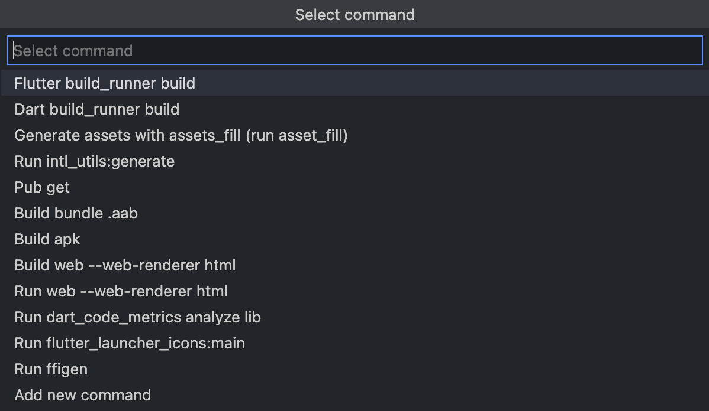

# Flutter-l3odr0id-commands README

# Special thanks to [@laefad](https://github.com/laefad)

Plugin with commands for quick work with Flutter utilities.

## Features

The extension adds an action button to the status bar.

Clicking the button will open the command picker, where you can select a predefined command or add your own.

<!-- Describe specific features of your extension including screenshots of your extension in action. Image paths are relative to this README file.

For example if there is an image subfolder under your extension project workspace:

\!\[feature X\]\(images/feature-x.png\) -->

<!-- > Tip: Many popular extensions utilize animations. This is an excellent way to show off your extension! We recommend short, focused animations that are easy to follow. -->

<!-- ## Extension Settings

Include if your extension adds any VS Code settings through the `contributes.configuration` extension point.

For example:

This extension contributes the following settings:

* `myExtension.enable`: enable/disable this extension
* `myExtension.thing`: set to `blah` to do something -->

<!-- ## Release Notes

### 1.0.0

Initial release of extension.

### 1.0.1

Added command for adding new shell command aliases. -->

-----------------------------------------------------------------------------------------------------------
<!-- ## Following extension guidelines

Ensure that you've read through the extensions guidelines and follow the best practices for creating your extension.

* [Extension Guidelines](https://code.visualstudio.com/api/references/extension-guidelines) -->

